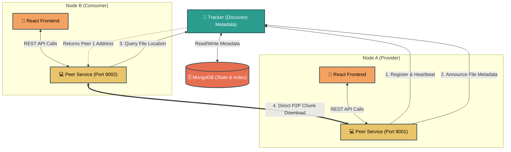

# P2P Notes Sharing Network 🚀

Welcome to the **P2P Notes** project. This repository contains the source code for a Distributed Computing (DC) based file-sharing system tailored for sharing academic notes across a peer-to-peer network. 

This README provides a comprehensive overview of the system architecture, Distributed Computing concepts used, and a step-by-step breakdown of how the network operates.

---

## 🖥️ What is this Project?

In a traditional academic setting, sharing digital notes often relies on centralized servers (e.g., Google Drive, institutional portals). If the central server experiences downtime, no one can access the files.

**P2P Notes** solves this by utilizing a **Tracker-based Peer-to-Peer (P2P) Architecture**. Instead of uploading files to a central server, users (nodes/peers) keep their files on their local machines. A central directory (the Tracker) simply maintains an index of which peers are online and what files they currently hold. When a user requests a file, they download it *directly* from another peer's machine.

---

## 🌐 Distributed Computing (DC) Concepts Used

This project fundamentally demonstrates key principles of **Distributed Computing**:

1. **Decentralized Storage:** Data is distributed across multiple autonomous nodes rather than residing in a single centralized database. This eliminates the storage cost on the central server and prevents a single point of failure for data hosting.
2. **Peer-to-Peer (P2P) Communication:** Nodes act as both clients (requesting files) and servers (providing files). When Peer A downloads a file from Peer B, they communicate directly, bypassing the central tracker.
3. **Heartbeat Mechanism (Fault Tolerance):** In distributed networks, nodes can disconnect unpredictably. To maintain an accurate view of the network state, peers send periodic "heartbeats" to the tracker. If a node fails to send a heartbeat within a specific TTL (Time-To-Live), the tracker assumes it has failed or disconnected and flags its files as unavailable.
4. **Data Hashing & Integrity:** Files are identified universally by their SHA-256 cryptographic hashes. This ensures data integrity during the P2P transfer; if a downloaded chunk does not match the metadata hash declared on the tracker, the network immediately rejects it.

---

## 🧩 System Architecture

The network consists of three primary components:

### 1. The Tracker (Discovery Service)
- **Role:** Acts as the central directory or "phonebook" for the network.
- **Functionality:** It does *not* store any file data. It strictly manages metadata (file names, hashes, topics) and peer states (IP addresses, ports, online/offline status).
- **Tech Stack:** Python (FastAPI) and MongoDB.

### 2. The Peer Node (Client & Server)
- **Role:** The actual node running on a user's machine.
- **Functionality:** Registers with the Tracker, parses local files into chunks, announces available files to the network, and opens an HTTP server to allow other peers to download files directly from its local storage.
- **Tech Stack:** Python (FastAPI) for concurrent downloading and serving.

### 3. The Frontend Client (UI)
- **Role:** The user-facing dashboard.
- **Functionality:** Communicates with both the local Peer API and the Tracker API to provide a seamless interface for uploading, searching, and downloading files.
- **Tech Stack:** React (Vite).

### 🗺️ System Flow Diagram

---

## 🎬 Network Scenarios Explained

Here is exactly how the system behaves under different network conditions:

### Scenario 1: Node Bootstrapping (Registration & Heartbeat)
When a Peer application starts, it immediately sends a registration payload (containing its IP and Port) to the Tracker. To prove it is alive, the Peer opens a background asynchronous thread that pings the Tracker's `/peers/heartbeat` endpoint every 10 seconds. The Tracker updates a timestamp in MongoDB. If a node suddenly crashes, the Tracker detects the stale timestamp and marks the node as "offline."

### Scenario 2: File Announcing (Seeding)
When a user uploads a PDF note, the file is saved exclusively in their local directory. The Peer node calculates a SHA-256 hash of the file and calculates how many chunks it will be divided into. It then sends an "Announce" request to the Tracker. The Tracker updates its database to reflect that this specific hash is currently available for download at this Peer's IP address.

### Scenario 3: Resource Discovery (Searching)
When a second user wants to find "Data Structures Sem 3", they query the system. The Frontend requests the search from the local Peer, which forwards it to the Tracker. The Tracker queries MongoDB and returns a list of files matching the query, critically including an array of IP addresses for peers currently holding the file who have sent a valid heartbeat recently.

### Scenario 4: Peer-to-Peer Data Transfer
Once the user clicks "Download", the magic of Distributed Computing takes over. The requesting Peer completely ignores the Tracker and initiates a direct HTTP stream connection to the providing Peer using the IP address retrieved in Scenario 3. The file is requested, streamed, and saved locally. Now, both peers have a copy of the file, making the network stronger and more resilient!

### Scenario 5: Fault Tolerance (Offline Providers)
If the original author of a note turns off their computer, their heartbeats will cease. The Tracker dynamically detects this and marks them as offline. If another user attempts to search for the file, the Tracker will inform them that no online replicas currently exist. However, if any other peer has previously downloaded that file (Scenario 4), *they* can fulfill the request instead.

---

## 🛠️ How to Run Locally

1. **Tracker Setup:** 
   Navigate to the `tracker` directory, install dependencies (`pip install -r requirements.txt`), and start the FastAPI uvicorn server. It requires a valid `MONGO_URI` in an `.env` file to store metadata.
   
2. **Peer Setup:** 
   Navigate to the `peer` directory. You can start multiple peers on the same machine by assigning them different ports (e.g., 9001, 9002) using `.env`.
   
3. **Frontend UI:** 
   Navigate to the `frontend` directory, run `npm install`, and start the development server using `npm run dev`. Connect the UI to your desired local peer port.
