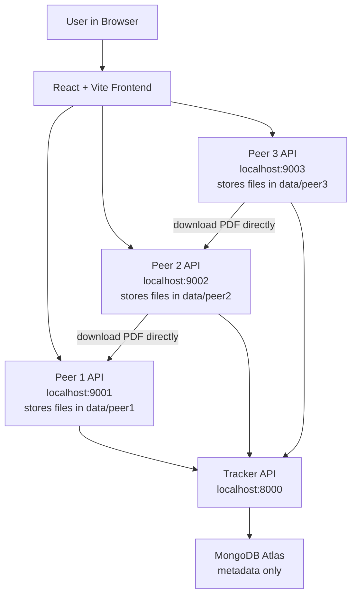

# DC_project - Peer-to-Peer Notes Sharing System

This is a Distributed Computing project where students can share notes and PDFs with each other using multiple peer nodes.

The most important idea:

```text
MongoDB stores only information about the PDF.
The actual PDF file is stored inside peer folders like data/peer1, data/peer2, data/peer3.
```

So if you upload a PDF from Peer 1, the real file is first stored in:

```text
data/peer1/
```

If Peer 2 downloads it, the same PDF becomes replicated in:

```text
data/peer1/
data/peer2/
```

If Peer 3 also downloads it, the same PDF becomes replicated in:

```text
data/peer1/
data/peer2/
data/peer3/
```

MongoDB does not store the PDF file. MongoDB stores metadata like filename, subject, file hash, file size, and which peer has the file.

## Explain Like I Am 5

Imagine 3 students:

```text
Peer 1 = Student A
Peer 2 = Student B
Peer 3 = Student C
```

There is also one notebook called the tracker:

```text
Tracker = a notebook that says who has which PDF
```

When Student A uploads a PDF:

```text
Student A keeps the real PDF in his bag.
The tracker writes: Student A has this PDF.
```

When Student B wants the PDF:

```text
Student B asks the tracker: Who has this PDF?
Tracker says: Student A has it.
Student B takes the PDF directly from Student A.
Now Student B also has a copy.
Tracker writes: Student A and Student B have this PDF.
```

Now if Student A goes home:

```text
Student C asks the tracker: Who has this PDF?
Tracker says: Student B has it.
Student C takes the PDF from Student B.
```

This is why it is called peer-to-peer sharing. Peers share files with other peers.

## Why This Is a Distributed Computing Project

This is not just a normal upload-download website.

In a normal website:

```text
User -> Central Server -> File
```

In this project:

```text
User -> Peer Node -> Other Peer Node -> File
```

Multiple peer nodes work together. The tracker helps them find each other, but the actual PDF transfer happens between peers.

Distributed Computing concepts used:

| DC Topic | Where It Is Used |
|---|---|
| Distributed system | Multiple peers run on different ports and work together. |
| Middleware | Tracker works like middleware for peer discovery. |
| IPC / RPC | Peers call each other's API endpoints over HTTP. |
| Message-oriented communication | Peers send register, heartbeat, announce, and search messages. |
| Stream-oriented communication | PDF files are downloaded as bytes from one peer to another. |
| Group communication idea | Tracker knows all active peers and their files. |
| Replication | Same PDF can exist on Peer 1, Peer 2, and Peer 3. |
| Consistency | SHA-256 hash checks that copied PDF is the same file. |
| Fault tolerance | If one peer goes down, another peer can still give the PDF if it has a replica. |
| Recovery | When a peer restarts, it registers again with the tracker. |
| Distributed file system idea | Files are spread across peers instead of kept in one server. |

## Architecture Diagram



## What Each Part Does

### Frontend

Technology:

```text
React + Vite
```

Why used:

```text
It gives a simple web page where the user can upload, search, and download notes.
```

### Tracker Server

Technology:

```text
Python FastAPI
```

Runs at:

```text
http://127.0.0.1:8000
```

Why used:

```text
It is the discovery server. It tells peers where a PDF is stored.
```

Tracker stores this information in MongoDB:

```text
peer_id
peer_name
peer_port
online/offline status
filename
subject
semester
file_hash
file_size
which peers have the PDF
```

Tracker does not store the PDF file itself.

### Peer Servers

Technology:

```text
Python FastAPI
```

Runs at:

```text
Peer 1: http://127.0.0.1:9001
Peer 2: http://127.0.0.1:9002
Peer 3: http://127.0.0.1:9003
```

Why used:

```text
Each peer acts like one student's machine.
Each peer can store PDFs and send PDFs to another peer.
```

Physical file storage:

```text
Peer 1 files -> data/peer1/
Peer 2 files -> data/peer2/
Peer 3 files -> data/peer3/
```

Each peer also has an `index.json` file that remembers its local files.

### MongoDB

Technology:

```text
MongoDB Atlas
```

Why used:

```text
MongoDB stores metadata in a flexible document format.
It is good for data like peers, files, and replicas.
```

Important:

```text
MongoDB stores metadata only.
MongoDB does not store the uploaded PDF.
```

### SHA-256 Hash

Why used:

```text
It checks whether the downloaded PDF is exactly the same as the uploaded PDF.
```

If the hash matches:

```text
The file is correct.
```

If the hash does not match:

```text
The file is corrupted or changed, so the app rejects it.
```

## Main Scenarios

### Scenario 1: Upload a PDF from Peer 1

User selects:

```text
Current peer API = http://127.0.0.1:9001
```

Then user uploads a PDF.

What happens:

```text
1. The PDF is saved inside data/peer1/.
2. Peer 1 calculates the SHA-256 file hash.
3. Peer 1 tells tracker: I have this PDF.
4. Tracker stores metadata in MongoDB.
```

Result:

```text
The actual PDF is in data/peer1/.
MongoDB only knows that Peer 1 has it.
```

### Scenario 2: Search for a PDF

User searches by filename, subject, or semester.

What happens:

```text
1. Frontend asks the current peer.
2. Current peer asks the tracker.
3. Tracker checks MongoDB.
4. Tracker returns matching files and replica list.
```

Result example:

```text
Stored on: Peer One (online)
```

This means the PDF is currently available from Peer 1.

### Scenario 3: Download PDF from Peer 1 to Peer 2

User selects:

```text
Current peer API = http://127.0.0.1:9002
```

Then user clicks Download.

What happens:

```text
1. Peer 2 asks tracker: Who has this PDF?
2. Tracker says: Peer 1 has it.
3. Peer 2 downloads the PDF directly from Peer 1.
4. Peer 2 checks SHA-256 hash.
5. Peer 2 saves the PDF inside data/peer2/.
6. Peer 2 tells tracker: I also have this PDF now.
7. Browser also saves a copy to your normal Downloads folder.
```

Result:

```text
The PDF is now replicated.
It is stored in data/peer1/ and data/peer2/.
```

### Scenario 4: Peer 1 Goes Down Before Replication

If the PDF exists only on Peer 1:

```text
Stored on: Peer One only
```

And Peer 1 goes down:

```text
Peer 2 cannot download the PDF.
Peer 3 cannot download the PDF.
```

Why:

```text
No other peer has a copy yet.
```

Viva explanation:

```text
Fault tolerance is not possible with only one copy. We need replication.
```

### Scenario 5: Peer 1 Goes Down After Replication

If the PDF exists on Peer 1 and Peer 2:

```text
Stored on: Peer One, Peer Two
```

And Peer 1 goes down:

```text
Peer 3 can still download the PDF from Peer 2.
```

Why:

```text
Peer 2 has a replica.
```

Viva explanation:

```text
The system is fault-tolerant after replication because the file survives even if one peer fails.
```

### Scenario 6: Tracker Goes Down

If tracker is down:

```text
Peers may still have PDFs in their local folders.
But search and discovery will not work properly.
```

Why:

```text
The tracker is the directory that tells peers where files are located.
```

Viva explanation:

```text
This project uses a tracker-based P2P design. The tracker is a discovery service. A future improvement is backup tracker election.
```

### Scenario 7: MongoDB Goes Down

If MongoDB is down:

```text
The tracker cannot read or write metadata.
Search, registration, and file announce may fail.
```

But:

```text
Already downloaded PDFs still exist inside peer folders.
```

Viva explanation:

```text
MongoDB is the metadata store. File data is still distributed across peers, but discovery needs metadata.
```

### Scenario 8: Peer Restarts

When a peer starts:

```text
1. It registers with tracker.
2. It sends heartbeat messages.
3. Tracker marks it online.
```

Viva explanation:

```text
Heartbeat messages help the tracker detect whether a peer is online or offline.
```

## How To Run

Install Python dependencies:

```bash
python3 -m venv .venv
source .venv/bin/activate
pip install -r requirements.txt
```

Install frontend dependencies:

```bash
cd frontend
npm install
cd ..
```

Create `.env`:

```bash
cp .env.example .env
```

Put your MongoDB URI in `.env`:

```text
MONGODB_URI="your MongoDB URI"
```

Start tracker:

```bash
.venv/bin/uvicorn tracker.app:app --host 127.0.0.1 --port 8000
```

Start Peer 1:

```bash
PEER_ID=peer1 PEER_NAME="Peer One" PEER_PORT=9001 PEER_STORAGE_DIR=./data/peer1 .venv/bin/uvicorn peer.app:app --host 127.0.0.1 --port 9001
```

Start Peer 2:

```bash
PEER_ID=peer2 PEER_NAME="Peer Two" PEER_PORT=9002 PEER_STORAGE_DIR=./data/peer2 .venv/bin/uvicorn peer.app:app --host 127.0.0.1 --port 9002
```

Start Peer 3:

```bash
PEER_ID=peer3 PEER_NAME="Peer Three" PEER_PORT=9003 PEER_STORAGE_DIR=./data/peer3 .venv/bin/uvicorn peer.app:app --host 127.0.0.1 --port 9003
```

Start frontend:

```bash
cd frontend
npm run dev
```

Open:

```text
http://127.0.0.1:5173
```

If port 5173 is busy, Vite may show another URL like:

```text
http://127.0.0.1:5174
```

## Demo Steps For Presentation

1. Start tracker, Peer 1, Peer 2, Peer 3, and frontend.
2. Open the frontend.
3. Set Current peer API to `http://127.0.0.1:9001`.
4. Upload a PDF.
5. Search the PDF and show: `Stored on: Peer One`.
6. Set Current peer API to `http://127.0.0.1:9002`.
7. Search and click Download.
8. Show that now it says: `Stored on: Peer One, Peer Two`.
9. Stop Peer 1.
10. Set Current peer API to `http://127.0.0.1:9003`.
11. Search and download the PDF from Peer 2.
12. Explain that replication made the system fault-tolerant.

## Useful URLs

```text
Frontend:       http://127.0.0.1:5173
Tracker health: http://127.0.0.1:8000/health
Tracker peers:  http://127.0.0.1:8000/peers
Tracker search: http://127.0.0.1:8000/files/search?q=your-search
Peer 1 info:    http://127.0.0.1:9001/info
Peer 2 info:    http://127.0.0.1:9002/info
Peer 3 info:    http://127.0.0.1:9003/info
```

## Important GitHub Note

The `.env` file contains private secrets, so it is ignored by Git.

Do not upload `.env` to GitHub.

Only upload `.env.example`, because it contains safe example values.

