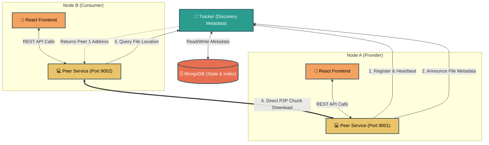

# P2P Notes Sharing Network 🚀

Welcome to the **P2P Notes** project. This repository contains the source code for a Distributed Computing (DC) based file-sharing system tailored for sharing academic notes across a peer-to-peer network. 

This README provides a comprehensive overview of the system architecture, Distributed Computing concepts used, and a step-by-step breakdown of how the network operates.

---

## 🖥️ What is this Project?

In a traditional academic setting, sharing digital notes often relies on centralized servers (e.g., Google Drive, institutional portals). If the central server experiences downtime, no one can access the files.

**P2P Notes** solves this by utilizing a **Tracker-based Peer-to-Peer (P2P) Architecture**. Instead of uploading files to a central server, users (nodes/peers) keep their files on their local machines. A central directory (the Tracker) simply maintains an index of which peers are online and what files they currently hold. When a user requests a file, they download it *directly* from another peer's machine.

---

## 🌐 Distributed Computing (DC) Core Concepts

This project was built from the ground up to demonstrate several foundational concepts taught in advanced Distributed Computing courses:

1. **Decentralized Storage & Replication**
   Rather than storing files on a single monolithic server, data is hosted across autonomous edge nodes. As more users download a file, the file is inherently replicated across the network. This naturally mitigates any single point of failure and drastically reduces storage and bandwidth overhead on the central server.
   
2. **Peer-to-Peer (P2P) Network Topology**
   Nodes in this system are symmetric; they act as both *clients* (consuming data) and *servers* (providing data). This contrasts with traditional Client-Server architectures. When Peer A wants a file from Peer B, they establish a direct HTTP stream, completely bypassing the Tracker during the heavy data transfer phase.

3. **Fault Tolerance via Heartbeats**
   In distributed systems, partial network failures and node disconnections are inevitable. To gracefully handle this, the system implements an asynchronous "Heartbeat mechanism." Nodes constantly broadcast lightweight pings to the Tracker. If the Tracker doesn't receive a ping within the TTL (Time-To-Live) window, it dynamically flags the node as "offline", ensuring the UI always serves fresh, active routes.

4. **Data Integrity & Cryptographic Hashing**
   Because file chunks are downloaded from autonomous peers, the system cannot trust filename strings alone for addressing. The project uses cryptographic SHA-256 hashes to universally identify and verify files. If a downloaded chunk does not mathematically match the requested hash from the Tracker, the data is rejected, ensuring strict safety across the untrusted network.

5. **Scalability & Load Distribution**
   In centralized systems, a spike in downloads creates a massive bottleneck. In this P2P project, the architecture thrives on load; as more users download a specific note, they immediately begin seeding it. This allows the network's collective upload bandwidth to scale horizontally automatically parallel to user demand.

---

## 🧩 System Architecture

The network consists of three primary components:

### 1. The Tracker (Discovery Service)
- **Role:** Acts as the central directory or "phonebook" for the network.
- **Functionality:** It does *not* store any file data. It strictly manages metadata (file names, hashes, topics) and peer states (IP addresses, ports, online/offline status).
- **Tech Stack:** Python (FastAPI) and MongoDB.

### 2. The Peer Node (Client & Server)
- **Role:** The actual node running on a user's machine.
- **Functionality:** Registers with the Tracker, parses local files into chunks, announces available files to the network, and opens an HTTP server to allow other peers to download files directly from its local storage.
- **Tech Stack:** Python (FastAPI) for concurrent downloading and serving.

### 3. The Frontend Client (UI)
- **Role:** The user-facing dashboard.
- **Functionality:** Communicates with both the local Peer API and the Tracker API to provide a seamless interface for uploading, searching, and downloading files.
- **Tech Stack:** React (Vite).

### 🗺️ System Flow Diagram



---

## 🎬 Network Scenarios Explained

Here is exactly how the system behaves under different network conditions:

### Scenario 1: Node Bootstrapping (Registration & Heartbeat)
When a Peer application starts, it immediately sends a registration payload (containing its IP and Port) to the Tracker. To prove it is alive, the Peer opens a background asynchronous thread that pings the Tracker's `/peers/heartbeat` endpoint every 10 seconds. The Tracker updates a timestamp in MongoDB. If a node suddenly crashes, the Tracker detects the stale timestamp and marks the node as "offline."

### Scenario 2: File Announcing (Seeding)
When a user uploads a PDF note, the file is saved exclusively in their local directory. The Peer node calculates a SHA-256 hash of the file and calculates how many chunks it will be divided into. It then sends an "Announce" request to the Tracker. The Tracker updates its database to reflect that this specific hash is currently available for download at this Peer's IP address.

### Scenario 3: Resource Discovery (Searching)
When a second user wants to find "Data Structures Sem 3", they query the system. The Frontend requests the search from the local Peer, which forwards it to the Tracker. The Tracker queries MongoDB and returns a list of files matching the query, critically including an array of IP addresses for peers currently holding the file who have sent a valid heartbeat recently.

### Scenario 4: Peer-to-Peer Data Transfer
Once the user clicks "Download", the magic of Distributed Computing takes over. The requesting Peer completely ignores the Tracker and initiates a direct HTTP stream connection to the providing Peer using the IP address retrieved in Scenario 3. The file is requested, streamed, and saved locally. Now, both peers have a copy of the file, making the network stronger and more resilient!

### Scenario 5: Fault Tolerance (Offline Providers)
If the original author of a note turns off their computer, their heartbeats will cease. The Tracker dynamically detects this and marks them as offline. If another user attempts to search for the file, the Tracker will inform them that no online replicas currently exist. However, if any other peer has previously downloaded that file (Scenario 4), *they* can fulfill the request instead.

---

## 🎓 Presentation Day: Step-by-Step Setup Guide

Since your Tracker and Frontend UI are already deployed in the cloud (Render & Vercel), you only need to run the actual "Peers" locally on your laptop to prove the P2P network works!

Follow these exact steps to run a flawless live demonstration:

### Step 1: Setup Local Environment
Before running the peers, ensure your Python environment is set up and dependencies are installed.
1. Open a terminal in the root folder of the project.
2. Create and activate a virtual environment, then install the required packages:
   ```bash
   python3 -m venv .venv
   source .venv/bin/activate
   pip install -r requirements.txt
   ```

### Step 2: Run Peer A (Alice) Locally
You can inject environment variables directly into the command to avoid messing with `.env` files.
1. Open a terminal and navigate to the `peer` directory. (Make sure your `.venv` is activated: `source ../.venv/bin/activate`)
2. Run Alice's node on port 9001. *(Note: We pass your specific Render Tracker URL so the laptop finds the cloud directory!)*
   ```bash
   TRACKER_URL="https://dc-project-nq5z.onrender.com" PEER_ID=peer1 PEER_NAME=Alice PEER_PORT=9001 PEER_STORAGE_DIR=./data/alice DOWNLOAD_DIR=./downloads/alice uvicorn app:app --port 9001
   ```
> *Leave this running. Alice is now actively sending heartbeats over the internet to your cloud Tracker!*

### Step 3: Run Peer B (Bob) Locally
1. Open a **second terminal** and navigate to the same `peer` directory. (Activate `.venv` here as well: `source ../.venv/bin/activate`)
2. Run Bob's node on port 9002:
   ```bash
   TRACKER_URL="https://dc-project-nq5z.onrender.com" PEER_ID=peer2 PEER_NAME=Bob PEER_PORT=9002 PEER_STORAGE_DIR=./data/bob DOWNLOAD_DIR=./downloads/bob uvicorn app:app --port 9002
   ```
> *Leave this running. Bob is now also online on port 9002.*

### Step 4: Bypass Browser Security (Crucial for Demo!) ⚠️
Because your Vercel website uses a secure `https://` connection, but your local Peers run on your laptop at `http://127.0.0.1`, Google Chrome will block the connection by default (This is called a Mixed Content Warning).
1. Open your Vercel website in Chrome.
2. Click the **Lock Icon / Site Information** button right next to the URL in the top address bar.
3. Go to **Site Settings**, find **Insecure Content**, and change it from Block to **Allow**.
4. Refresh the page!

### Step 5: The Live Demo Flow! 🔥
1. **Act as Alice (Provider):** On your Vercel website, ensure the "Current peer API" box says `http://127.0.0.1:9001` and click **Refresh Status**. In the UI, upload a dummy PDF file and title it "DC Notes".
2. **Act as Bob (Consumer):** Change the "Current peer API" input box to `http://127.0.0.1:9002` and click **Refresh Status**. You are now securely controlling Bob!
3. **P2P Magic:** As Bob, search for "DC Notes". The Vercel UI will ask the Render Tracker where the file is. It will reply that Alice (port 9001) has it. When you click download, watch your two Mac terminals—you will literally see Bob (9002) connecting locally and pulling the file chunks directly from Alice (9001) without involving the cloud database anymore!

**Boom! You just demonstrated a completely functional Decentralized Network! 💯**
